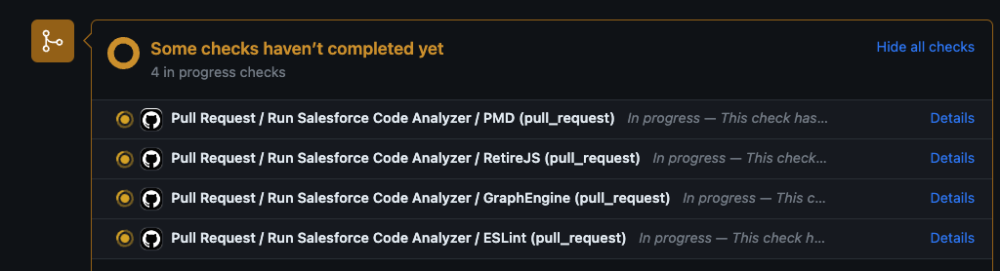

# Hutte Recipe - Code Quality Analysis with Salesforce Scanner

> This recipe uses [Salesforce Code Analyzer](https://forcedotcom.github.io/sfdx-scanner/) to perform a Quality Scan of the metadata. This repository contains intended vulnerabilities to showcase the findings of the scans.

Example:




## Prerequisites

- a GitHub repository with a valid sfdx project

## Step 1: Create GitHub Workflows and PMD Ruleset

Create the following three files:

`.github/workflows/code-analyze.yml`

```yaml
name: Salesforce Code Quality

on:
  workflow_dispatch:
  workflow_call:

jobs:
  PMD:
    runs-on: ubuntu-latest
    steps:
      - uses: actions/checkout@v4
      - uses: actions/setup-node@v3
      - name: Setup Salesforce CLI
        run: |
          npm install --global @salesforce/cli
          sf plugins install @salesforce/sfdx-scanner
      - name: SF Code Analyzer - PMD
        run: |
          sf scanner:run --engine pmd --target force-app --pmdconfig=pmd/ruleset.xml --format table --severity-threshold 3

  RetireJS:
    runs-on: ubuntu-latest
    steps:
      - uses: actions/checkout@v4
      - uses: actions/setup-node@v3
      - name: Setup Salesforce CLI
        run: |
          npm install --global @salesforce/cli
          sf plugins:install @salesforce/sfdx-scanner
      - name: SF Code Analyzer - RetireJS
        run: |
          sf scanner:run --engine "retire-js" --target force-app --format table --severity-threshold 3

  GraphEngine:
    runs-on: ubuntu-latest
    steps:
      - uses: actions/checkout@v4
      - uses: actions/setup-node@v3
      - name: Setup Salesforce CLI
        run: |
          npm install --global @salesforce/cli
          sf plugins install @salesforce/sfdx-scanner
      - name: SF Code Analyzer - Data Flow Analysis
        run: |
          sf scanner:run:dfa --target force-app --projectdir force-app --format table --severity-threshold 3

  ESLint:
    runs-on: ubuntu-latest
    steps:
      - uses: actions/checkout@v4
      - uses: actions/setup-node@v3
      - name: Setup Salesforce CLI
        run: |
          npm install --global @salesforce/cli
          sf plugins install @salesforce/sfdx-scanner
      - name: SF Code Analyzer - ESLint
        run: |
          sf scanner:run --engine eslint --eslintconfig=.eslintrc.json --target "force-app/**/*.js" --format table --severity-threshold 3
```

**Note 1**: Each tool scan (engine) runs in an independent job, therefore you may exclude any of those if desired.

**Note 2**: The scans are configured to run in parallel, although those can be refactored to run sequentially, either by joining them into the same job or using the [`needs`](https://docs.github.com/en/actions/using-jobs/using-jobs-in-a-workflow#defining-prerequisite-jobs) property in those.

`.github/workflows/pr.yml`

```yaml
name: Pull Request

on:
  pull_request:

jobs:
  code-analyze:
    name: Run Salesforce Code Analyzer
    uses: ./.github/workflows/code-analyze.yml
    secrets: inherit
```

`.github/workflows/main.yml`

```yaml
name: Main

on:
  push:
    branches:
      - main

jobs:
  code-analyze:
    name: Run Salesforce Code Analyzer
    uses: ./.github/workflows/code-analyze.yml
    secrets: inherit
```

`pmd/ruleset.xml`

```xml
<?xml version="1.0" ?>
<ruleset
    name="Baseline PMD Ruleset"
    xmlns="http://pmd.sourceforge.net/ruleset/2.0.0"
    xmlns:xsi="http://www.w3.org/2001/XMLSchema-instance"
    xsi:schemaLocation="http://pmd.sourceforge.net/ruleset/2.0.0 https://pmd.sourceforge.io/ruleset_2_0_0.xsd"
>
    <description>Baseline PMD Ruleset</description>

    <!-- DEFAULT RULE CATEGORIES -->
    <rule ref="category/apex/bestpractices.xml" />
    <rule ref="category/apex/codestyle.xml" />
    <rule ref="category/apex/design.xml" />
    <rule ref="category/apex/documentation.xml" />
    <rule ref="category/apex/errorprone.xml" />
    <rule ref="category/apex/performance.xml" />
    <rule ref="category/apex/security.xml" />
</ruleset>
```

## Step 2: Validate

- Create a PR and verify the Action was run successfully
- Merge the PR and verify the Action was run successfully

Example:


