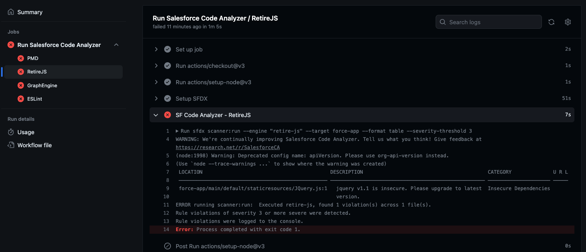

# Hutte Recipe - Code Quality Analysis with Salesforce Scanner

> This recipe uses [Salesforce Code Analyzer](https://forcedotcom.github.io/sfdx-scanner/) to perform a Quality Scan of the metadata. This repository contains intended vulnerabilities to showcase the findings of the scans.

Example:



## Prerequisites

- a GitHub repository with a valid sfdx project
- sfdx-scanner plugin (`sfdx plugins:install @salesforce/sfdx-scanner`)

## Steps

### Step 1

Create the following three GitHub Workflows:

`.github/workflows/code-analyze.yml`

```yaml
# Based on https://github.com/mehdisfdc/sfdx-GitHub-actions/blob/main/.github/workflows/main.yml
name: Salesforce Code Quality

on:
  workflow_dispatch:
  workflow_call:

jobs:
  PMD:
    runs-on: ubuntu-latest
    steps:
      - uses: actions/checkout@v3
        with:
          fetch-depth: 0
      - uses: actions/setup-node@v3
      - name: Setup SFDX
        run: |
          npm install --global sfdx-cli
          sfdx --version
          sfdx plugins:install @salesforce/sfdx-scanner
      - name: SF Code Analyzer - PMD
        run: |
          sfdx scanner:run --engine pmd --target force-app --pmdconfig=pmd/ruleset.xml --format table --severity-threshold 3
      
  RetireJS:
    runs-on: ubuntu-latest
    steps:
      - uses: actions/checkout@v3
        with:
          fetch-depth: 0
      - uses: actions/setup-node@v3
      - name: Setup SFDX
        run: |
          npm install --global sfdx-cli
          sfdx --version
          sfdx plugins:install @salesforce/sfdx-scanner 
      - name: SF Code Analyzer - RetireJS
        run: |
          sfdx scanner:run --engine "retire-js" --target force-app --format table --severity-threshold 3 
      
  GraphEngine:
    runs-on: ubuntu-latest
    steps:
      - uses: actions/checkout@v3
        with:
          fetch-depth: 0
      - uses: actions/setup-node@v3
      - name: Setup SFDX
        run: |
          npm install --global sfdx-cli
          sfdx --version
          sfdx plugins:install @salesforce/sfdx-scanner 
      - name: SF Code Analyzer - Data Flow Analysis
        run: |
          sfdx scanner:run:dfa --target force-app --projectdir force-app --format table --severity-threshold 3

  ESLint:
    runs-on: ubuntu-latest
    steps:
      - uses: actions/checkout@v3
        with:
          fetch-depth: 0
      - uses: actions/setup-node@v3
      - name: Setup SFDX
        run: |
          npm install --global sfdx-cli
          sfdx --version
          sfdx plugins:install @salesforce/sfdx-scanner
      - name: SF Code Analyzer - ESLint
        run: |
          sfdx scanner:run --engine eslint --eslintconfig=.eslintrc.json --target "force-app/**/*.js" --format table --severity-threshold 3
```
**Note 1**: Each tool scan (engine) runs in an independent job, therefore you may exclude any of those if desired.

**Note 2**: The scans are configured to run in parallel, although those can be refactored to run sequentially, either by joining them into the same job or using the [`needs`](https://docs.github.com/en/actions/using-jobs/using-jobs-in-a-workflow#defining-prerequisite-jobs) property in those.


`.github/workflows/pr.yml`

```yaml
name: Pull Request

on:
  pull_request:

jobs:
  code-analyze:
    name: Run Salesforce Code Analyzer
    uses: ./.github/workflows/code-analyze.yml
    secrets: inherit
```

`.github/workflows/main.yml`

```yaml
name: Main

on:
  push:
    branches:
      - main

jobs:
  code-analyze:
    name: Run Salesforce Code Analyzer
    uses: ./.github/workflows/code-analyze.yml
    secrets: inherit
```

### Step 2

- Create a PR and verify the Action was run successfully
- Merge the PR and verify the Action was run successfully

****
## Other Git Platforms

It's in Hutte Roadmap to provide the translation of this recipe for other platforms like `Gitlab`, `Azure DevOps`, and `Bitbucket`.

****
